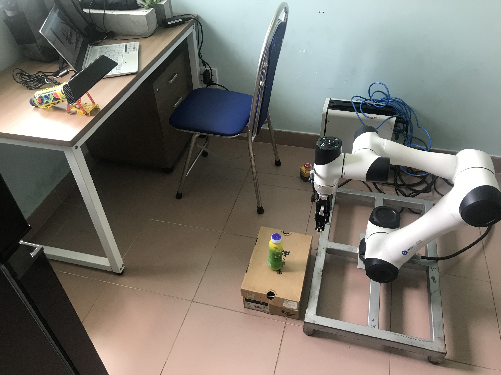

# Volumetric Grasping Network

VGN is a 3D convolutional neural network for real-time 6 DOF grasp pose detection. The network accepts a Truncated Signed Distance Function (TSDF) representation of the scene and outputs a volume of the same spatial resolution, where each cell contains the predicted quality, orientation, and width of a grasp executed at the center of the voxel. The network is trained on a synthetic grasping dataset generated with physics simulation.

An example of open-loop grasp execution with a `Dobot CR5` and a fixed position camera `Kinect v1` is also added to this repository [[video](https://youtu.be/eU_ObUKIUto)] . For more information, please visit [`VGN`](https://github.com/ethz-asl/vgn)