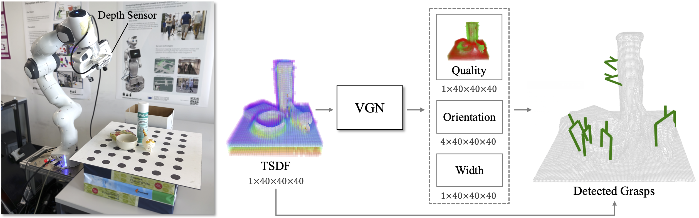

# Volumetric Grasping Network

VGN is a 3D convolutional neural network for real-time 6 DOF grasp pose detection. The network accepts a Truncated Signed Distance Function (TSDF) representation of the scene and outputs a volume of the same spatial resolution, where each cell contains the predicted quality, orientation, and width of a grasp executed at the center of the voxel. The network is trained on a synthetic grasping dataset generated with physics simulation.

This repository contains the implementation of the following publication:

* M. Breyer, J. J. Chung, L. Ott, R. Siegwart, and J. Nieto. Volumetric Grasping Network: Real-time 6 DOF Grasp Detection in Clutter. _Conference on Robot Learning (CoRL 2020)_, 2020. [[pdf](http://arxiv.org/abs/2101.01132)][[video](https://youtu.be/FXjvFDcV6E0)]

An example of open-loop grasp execution with a `Dobot CR5` and a fixed position camera `Kinect v1` is also added to this repository. For more information, please visit [`VGN`](https://github.com/ethz-asl/vgn)