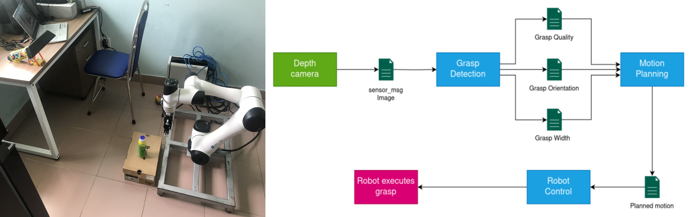

# Robotic Arm grasps objects

We design a system that predicts 6 DOF grasps pose from 3D scene information gathered from `Kinect v1` depth camera. Robot `Dobot CR5` is used to perform the grasping execution [[video](https://youtu.be/eU_ObUKIUto)].



The next sections provide instructions for getting started with the system.

* [Installation](#installation)
* [Depth camera](#depth-camera)
* [Robot Grasping](#robot-grasping)


## Installation

The following instructions were tested with `python3.8` on Ubuntu 20.04. A ROS installation is only required for visualizations and interfacing hardware.

1. Clone the repository into the `src` folder of a catkin workspace.

```
git clone https://github.com/Sonnguyen1402/Grasp_Detection
```

2. Create and activate a new `conda` environment.

3. Install the Python dependencies within the activated conda environment.

```
pip install -r requirements.txt
```

4. Build and source the catkin workspace.

```
catkin build vgn
source /path/to/catkin_ws/devel/setup.zsh
```


## Depth Camera
We use `Kinect v1` depth camera to gather 3D scene of  workspace. Follow [here](https://aibegins.net/2020/11/22/give-your-next-robot-3d-vision-kinect-v1-with-ros-noetic/) for installation.

## Robot Grasping
Since Dobot CR5 collaborative robot with ROS only supported on Ubuntu 16.04/18.04, we decided to control robot through `DobotSCStudio` software (run on windows computer). Visit [Dobot website](https://www.dobot-robots.com/products/cr-series/cr5.html) to download control software and manual.

1. Connect all computers to robot network.
2. On the Windows computer, copy code from [`dobot/robot_control.txt`](https://github.com/Sonnguyen1402/Robotic-arm/blob/main/dobot/robot_control.txt) to script section in `DobotSCStudio` software. Then, run the script.
3. On the Ubuntu computer, launch `Kinect` camera driver and run the system:
```
roslaunch freenect_launch freenect.launch
python scripts/dobot_grasp.py --model data/models/vgn_conv.pth
```

Our code is largely based on [VGN](https://github.com/ethz-asl/vgn).
